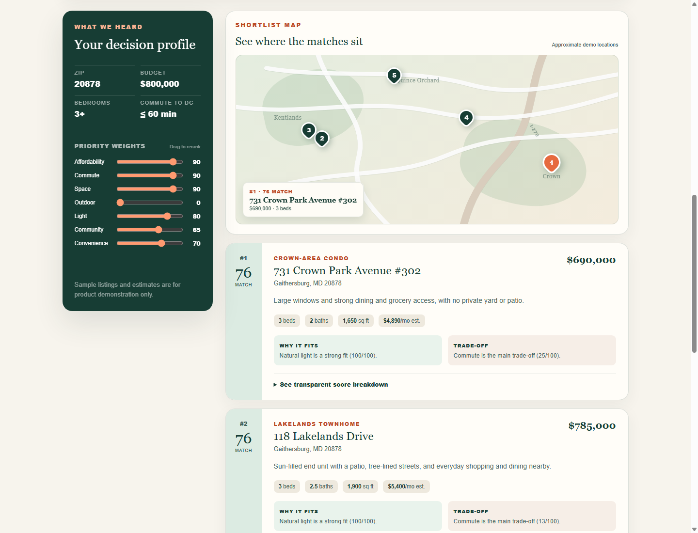
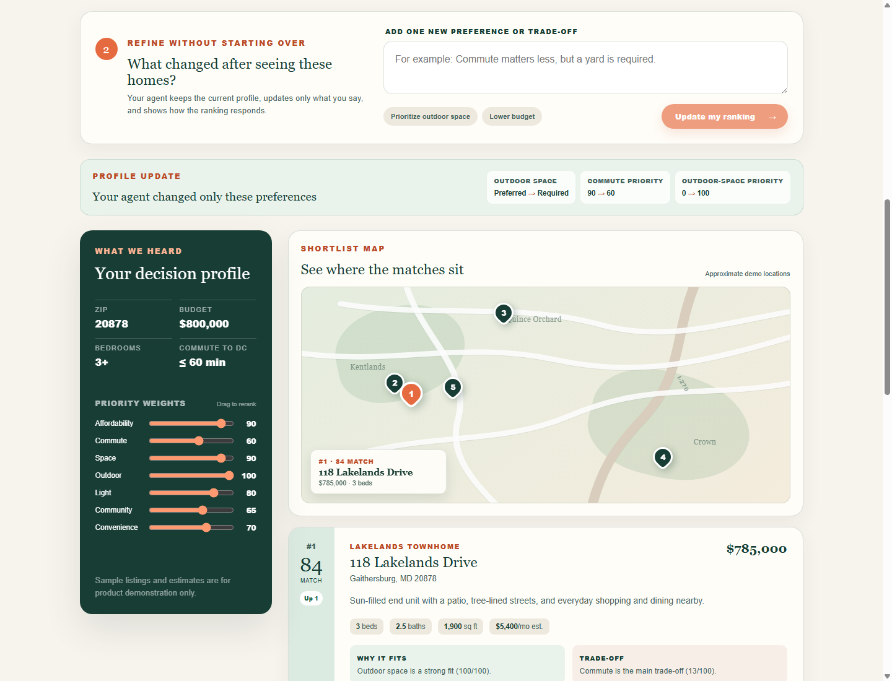

# GPT Home Buying Agent — judge testing guide

## Submission links

| Item | Value | Status |
| --- | --- | --- |
| Live production demo | [gpt-home-buying-agent.vercel.app](https://gpt-home-buying-agent.vercel.app) | Verified: HTTP 200 and live GPT-5.6 response |
| Devpost project | [devpost.com/software/gpt-home-buying-agent](https://devpost.com/software/gpt-home-buying-agent) | Draft |
| Source repository | **TODO: add the GitHub/GitLab/Bitbucket URL after creating and pushing the repository** | Required before submission |
| License | [MIT](./LICENSE) | Ready |
| Demo video | **TODO: add the public YouTube URL** | Required before submission |
| Codex `/feedback` Session ID | `019f7bdd-a64f-7532-a7cd-06e61ce36d46` | Ready |

The production deployment was verified on July 19, 2026. Its `/api/match` endpoint returned `mode: gpt-5.6`, five matches, and no fallback warning.

## Two-minute testing path

No account or login is required.

1. Open the [live demo](https://gpt-home-buying-agent.vercel.app).
2. Keep the prefilled request and select **Find my matches**:

   > I want a bright 3-bedroom in 20878 under $800k. Keep my commute to DC under 1 hour. Pretty community and convenient to groceries and restaurants.

3. Confirm the results display **Interpreted by GPT-5.6** and review the structured ZIP, budget, bedrooms, commute limit, and priority weights.
4. Drag a priority slider. The shortlist, scores, movement labels, and numbered map markers update immediately using deterministic TypeScript ranking.
5. Expand **See transparent score breakdown** on a home to inspect all seven factors.
6. Submit this follow-up in the refinement panel:

   > Commute matters less now, but outdoor space is required.

7. Confirm the before/after audit shows only the explicit changes, homes without outdoor space disappear, and the ranking and map update.

## Expected behavior

- GPT-5.6 handles the initial natural-language extraction and the conversational profile revision through strict Structured Outputs.
- TypeScript handles hard filtering, scoring, change detection, rank ordering, and manual slider adjustments.
- The app returns no more than five eligible homes.
- The map uses approximate fictional coordinates and is intentionally labeled as a demo visualization.
- If the OpenAI API is unavailable, the interface clearly labels the deterministic local fallback rather than presenting it as GPT output.

## Screenshots

### Explainable shortlist, adjustable priorities, and synchronized map

### Conversational refinement with before/after audit and reranking

## Judge notes

- All listings, addresses, map coordinates, commute times, quality ratings, and monthly estimates are fictional demonstration data.
- The project does not use protected characteristics or demographic proxies in ranking.
- No outreach, showing scheduling, lending decision, or purchase action is performed.
- See [README.md](./README.md) for installation, environment variables, architecture, Codex contributions, exact GPT-5.6 usage, and limitations.

## Final submission checklist

- [x] Public working deployment
- [x] GPT-5.6 production path verified
- [x] Two submission screenshots
- [x] Testing instructions
- [x] MIT license
- [ ] Public or judge-accessible source repository URL
- [ ] Public YouTube demo video under three minutes with audio
- [x] Codex `/feedback` Session ID
- [ ] Replace the Devpost description's unimplemented side-by-side-comparison claim
- [ ] Register for and submit the project to OpenAI Build Week
